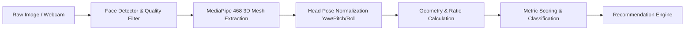

# Comprehensive System Report: Automated Facial Harmony & Aesthetic Analysis Platform

---

## 1. Executive Summary

The objective of this platform is to bridge the gap between classical anthropometry, evolutionary psychology, computer vision, and modern styling. Rather than delivering a reductive, blunt "attractiveness rating," the platform operates as a **Scientific Facial Harmony & Personalized Grooming Assistant**.

By combining client-side 3D facial landmark detection with geometric ratio algorithms and a dynamic rule-based styling engine, the platform provides users with:
1. An objective breakdown of their facial proportions and symmetry.
2. Interactive visual landmark overlays and harmony metrics.
3. Tailored, actionable grooming, haircut, beard, eyewear, and lifestyle recommendations.
4. Complete privacy through local, in-browser processing.

---

## 2. Scientific & Anthropometric Foundation

Facial aesthetics and perceived "handsomeness" are rooted in well-documented biological markers of genetic health, hormonal balance, and geometric harmony.

### A. Classical Proportions
* **Vertical Harmony (Rule of Thirds):**
  * **Upper Third:** Trichion (hairline) to Glabella (brow level) $\approx 33.3\%$.
  * **Middle Third:** Glabella to Subnasale (base of nose) $\approx 33.3\%$.
  * **Lower Third:** Subnasale to Menton (tip of chin) $\approx 33.3\%$.
  * *Lower Third Sub-division:* Subnasale to Stomion (lip closure) = $1/3$; Stomion to Menton = $2/3$.
* **Horizontal Harmony (Rule of Fifths):**
  * The face width at eye level is divided into five equal segments, each approximately equal to the width of one palpebral fissure (eye width):
    * Lateral face margin to outer canthus (Right) = $1\times$
    * Right Eye width = $1\times$
    * Intercanthal distance (inner corner to inner corner) = $1\times$
    * Left Eye width = $1\times$
    * Outer canthus to lateral face margin (Left) = $1\times$
* **Golden Ratio ($\phi \approx 1.618$):**
  * Facial height to bizygomatic width ratio ideally approximates $1.35 - 1.618$.
  * Mouth width is ideally $\approx 1.618 \times$ nasal base width.

### B. Dimorphic Masculine Characteristics ("Handsomeness" Markers)
High prenatal and pubertal testosterone levels manifest in specific skeletal and soft tissue developments:

| Feature | Aesthetic Ideal | Biometric Significance |
| :--- | :--- | :--- |
| **Jawline (Mandible)** | Sharp, visible border; bigonial width $75\% - 80\%$ of cheekbones | High bone mineralization, strength |
| **Gonial Angle** | $120^\circ - 130^\circ$ | Crisp lateral jaw corner (obtuse $>135^\circ$ appears recessed) |
| **Chin Projection** | Square chin aligning vertically with lower lip in profile | Pogonic development |
| **fWHR (Facial Width-to-Height Ratio)**| $1.80 - 2.05$ | Correlated with perceived masculinity and assertiveness |
| **Canthal Tilt** | Neutral to positive ($+2^\circ$ to $+5^\circ$) | Upward or straight outer eye corner slant |
| **Supraorbital Ridge** | Prominent brow with low-set, straight eyebrows | Minimal upper eyelid exposure; "hunter" gaze |
| **Nasolabial Angle** | $90^\circ - 95^\circ$ in men (vs. $100^\circ - 105^\circ$ in women) | Straighter nasal dorsum with supported tip |

### C. Universal Biological Signals
1. **Fluctuating Asymmetry (FA):** Minute deviations from bilateral symmetry reflect developmental instability or environmental stress. High symmetry is universally correlated with attractiveness.
2. **Koinophilia (Averageness):** Evolutionary preference for composite average traits, which historically indicated absence of harmful genetic mutations.
3. **Skin Uniformity & Contrast:** Healthy microcirculation, absence of hyperpigmentation, and clear sclera serve as immediate vitality proxies.

---

## 3. Mathematical & Computer Vision Methodology

Using modern computer vision libraries (such as **MediaPipe Face Mesh**, which provides 468 3D $(x, y, z)$ coordinates), we can compute exact mathematical metrics.



### Key Landmark Indices (MediaPipe Coordinate Mapping)
* **Trichion / Forehead Top:** Landmark `10`
* **Glabella / Mid-Brow:** Landmark `9` / `168`
* **Subnasale / Nose Base:** Landmark `2`
* **Stomion / Lip Center:** Landmark `0` (upper) & `17` (lower)
* **Menton / Chin Tip:** Landmark `152`
* **Outer Eye Canthi:** Left `263`, Right `33`
* **Inner Eye Canthi:** Left `362`, Right `133`
* **Gonion (Jaw Angles):** Left `389`, Right `162`
* **Zygion (Cheekbone Peaks):** Left `454`, Right `234`

### Mathematical Formulations

#### 1. Vertical Thirds Ratio
Let $D(A, B)$ be the Euclidean distance projected along the facial vertical axis:
$$\text{Upper Third} = \frac{D(10, 9)}{D(10, 152)}, \quad \text{Middle Third} = \frac{D(9, 2)}{D(10, 152)}, \quad \text{Lower Third} = \frac{D(2, 152)}{D(10, 152)}$$
$$\text{Ideal Ratio Target} = [0.333, 0.333, 0.333]$$

#### 2. Bilateral Facial Symmetry Index
Construct the central sagittal axis line $L_{mid}$ through Glabella (`168`), Subnasale (`2`), and Menton (`152`). For $N$ paired bilateral landmark points $(P_{left}^i, P_{right}^i)$:
$$\text{Asymmetry}(i) = \left| \text{dist}(P_{left}^i, L_{mid}) - \text{dist}(P_{right}^i, L_{mid}) \right|$$
$$\text{Symmetry Score} = 100 \times \left( 1 - \frac{\sum_{i=1}^N \text{Asymmetry}(i)}{\sum_{i=1}^N \text{dist}(P_{left}^i, L_{mid}) + \text{dist}(P_{right}^i, L_{mid})} \right)$$

#### 3. Canthal Tilt Angle
$$\theta_{tilt} = \arctan\left(\frac{y_{outer} - y_{inner}}{x_{outer} - x_{inner}}\right)$$
* $\theta > 0$: Positive Canthal Tilt (Aesthetically favorable)
* $\theta = 0$: Neutral
* $\theta < 0$: Negative Canthal Tilt (Drooping appearance)

---

## 4. Dynamic Suggestion & Recommendation Engine

The recommendation engine translates detected geometric deviations into actionable styling choices.

```
+-----------------------------------------------------------------------------------+
|                           RECOMMENDATION MATRIX                                   |
+---------------------+-------------------------------+-----------------------------+
| Feature Detected    | Problem / Characteristic      | Actionable Recommendation   |
+---------------------+-------------------------------+-----------------------------+
| High Forehead       | Upper third > 36%             | Textured French Crop, Fringe|
| Short Forehead      | Upper third < 30%             | Quiff, Pompadour, Up-Sweep  |
| Round Face          | fWHR < 1.6, Soft Gonion       | High skin fade, angular cuts|
| Oblong Face         | Height:Width > 1.6            | Side-part, medium side bulk |
| Soft / Recessed Jaw | Lower third < 30%, Low angle  | Tapered 8mm chin beard      |
| Negative Tilt Eyes  | Outer eye lower than inner    | Lower-brow tail cleanup     |
| Facial Bloating     | Low zygomatic prominence      | Sodium cut, ice plunge, gua |
+---------------------+-------------------------------+-----------------------------+
```

### Detailed Recommendation Categories

#### 1. Haircut Matching
* **Round Face:** Goal is vertical elongation. Keep the sides tight (skin fade or #1) with textured volume on top.
* **Square Face:** Highlight strong jawline with classic, structured cuts (buzz cut, crew cut, textured side part).
* **Oblong Face:** Avoid tall pompadours. Introduce horizontal lines with textured fringes and length on the sides.

#### 2. Beard & Mandibular Contouring
* **Recessed Chin:** Keep beard short along the cheeks and fade it longer toward the chin ($10\text{mm} - 15\text{mm}$) to extend projection forward.
* **Weak Jaw Line:** Shape a razor-sharp neckline 1–2 fingers above the thyroid cartilage (Adam's apple). The clean shadow sharpens the perceived jawline instantly.
* **Prominent Chin:** Maintain a uniform short stubble ($2\text{mm} - 3\text{mm}$) to avoid exaggerating chin length.

#### 3. Eyewear & Sunglasses
* **Geometric Contrast Principle:**
  * Curvilinear (round/oval) faces require sharp, angular frames (Wayfarers, square acetate).
  * Angular (square/diamond) faces require round or wire-rimmed frames (Aviators, circular acetate) to balance sharpness.

#### 4. Physiological & Lifestyle Optimization
* **Body Fat Calibration:** Natural facial structure is obscured at $>16\%$ body fat. Peak mandibular and cheekbone prominence typically reveals between $10\% - 14\%$ body fat.
* **Water Retention Management:** Address sodium-potassium balance, hydration (minimum 3L water/day), and sleep hygiene to eliminate morning periorbital and cheek swelling.
* **Cervical Posture Correction:** "Tech neck" (forward head posture) pulls the hyoid muscle forward, obscuring the jawline. Prescribe daily chin tuck exercises.

---

## 5. Website Architecture & Technical Specification

### A. Recommended Tech Stack
* **Frontend:** Next.js 14 / React 18, TypeScript, Tailwind CSS.
* **Facial Processing:** MediaPipe Face Landmarker (WebAssembly & WebGL runtime).
* **Canvas Rendering:** HTML5 2D Canvas or Konva.js for proportional overlays and vector angle drawing.
* **State & Export:** Zustand for metrics state; `html2canvas` / `jspdf` for downloadable PDF reports.

### B. User Interface Hierarchy

```
[ Navbar: Logo | How It Works | Science & Ratios | Privacy ]
-------------------------------------------------------------------
[ Hero: "Discover Your Facial Harmony & Personalized Grooming Plan" ]
[ CTA: Drag & Drop Photo or Open Live Camera ]
-------------------------------------------------------------------
[ Analysis Viewport ]
  ├── Left: Interactive Photo with Canvas Overlays
  │     ├── [✓] Rule of Thirds Guide
  │     ├── [✓] Symmetry Midline
  │     ├── [ ] Canthal Tilt Angles
  │     └── [ ] Golden Ratio Mask
  └── Right: Harmony Scorecard & Biometrics
        ├── Overall Harmony Index: [ 89 / 100 ]
        ├── Face Shape: [ Square-Oval ]
        ├── Vertical Harmony: [ 33% | 34% | 33% (Optimal) ]
        ├── Bilateral Symmetry: [ 94.2% ]
        └── Canthal Tilt: [ +3.8° (Positive) ]
-------------------------------------------------------------------
[ Actionable Recommendations Dashboard ]
  ├── Tab 1: Recommended Haircuts (with visual card examples)
  ├── Tab 2: Beard & Jaw Contouring Strategy
  ├── Tab 3: Eyewear Frame Matcher
  └── Tab 4: Lifestyle, Bloat & Posture Protocols
-------------------------------------------------------------------
[ Download Full PDF Report ] [ Share Analysis ]
```

### C. Privacy, Security & Ethics Principles
1. **100% Client-Side Processing:** MediaPipe runs via WebAssembly inside the user's browser. No facial photographs are ever sent to or stored on a remote server.
2. **Positive, Constructive Framing:** All copy avoids derogatory terms, focusing strictly on "Harmony, Symmetry, and Optimization."
3. **Scientific Disclaimer:** Prominently display that geometric harmony is a classical styling tool and does not define personal worth.

---

## 6. Implementation Roadmap

1. **Phase 1: Metric Engine Prototype (Immediate)**
   * Implement in-browser MediaPipe Face Mesh landmark extraction.
   * Write mathematical functions for Thirds, Fifths, Symmetry, and Angles.
2. **Phase 2: Interactive Canvas & Overlay System**
   * Build canvas overlay component with toggles for thirds, midline, and angles.
3. **Phase 3: Dynamic Recommendation System**
   * Build rule engine that maps computed metric vectors to categorized style cards.
4. **Phase 4: Polish & Export**
   * Style with dark/light modern UI, add PDF export, and test across varied face types and lighting conditions.
